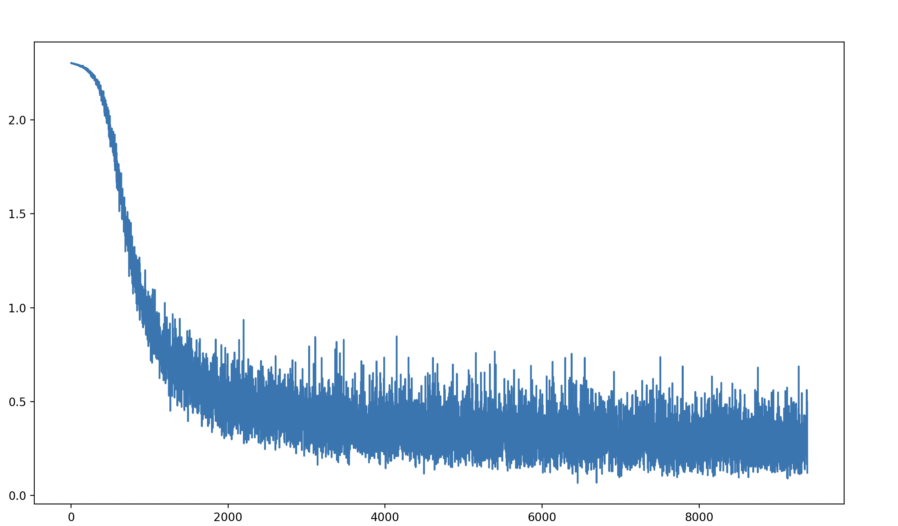
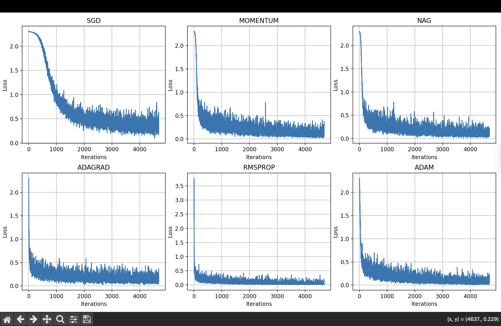

# 🧠 Neural Network from Scratch (NumPy Implementation)

A simple **two-layer Neural Network** (built completely from scratch using NumPy) trained on the **MNIST handwritten digits dataset** (0–9).  
This project demonstrates how a neural network works **without using deep learning frameworks** like TensorFlow or PyTorch — only `NumPy`.

---

## 🚀 Project Overview

This project implements:
- A **feedforward neural network** with one hidden layer
- **ReLU** activation for the hidden layer
- **Softmax** activation for the output layer
- **Mini-batch gradient descent** for optimization
- **Cross-entropy loss** function for training
- **Multiple optimizers:**
    - SGD
    - Momentum
    - NAG (Nesterov Accelerated Gradient)
    - Adagrad
    - RMSProp
    - Adam
- **Accuracy evaluation** on test data

---

## 🧩 Architecture
```
Input (784 nodes: 28x28 image)
↓
Hidden Layer (128 neurons, ReLU)
↓
Output Layer (10 neurons, Softmax)
```
---
## 🧰 Project Structure
```
NN_from_scratch/
│
├── main.py          # Main training and evaluation script
├── utils.py         # Utility functions (ReLU, Softmax, loss, accuracy)
├── optimizer.py     # Implementation of various optimizers
├── data/            # Folder containing MNIST dataset (mnist.npz)
├── README.md        # Project documentation (you’re reading this)
├── requirements.txt # Dependencies (NumPy, scikit-learn, matplotlib)
└── loss_histories.npy # Saved loss curves for all optimizers
```
---
## 📊 Results
- Trained the network with 6 different optimizers.
- Each optimizer has its own training loss curve.


---

---

| Optimizer | Test Accuracy |
| --------- | ------------- |
| SGD       | 90.39%        |
| Momentum  | 96.51%        |
| NAG       | 96.69%        |
| Adagrad   | 96.84%        |
| RMSProp   | 97.53%        |
| Adam      | 97.23%        |

---

## 📘 Key Learnings

- Understanding how forward and backward propagation work mathematically
- Implementing gradient descent and advanced optimizers manually
- Working with one-hot encoding for categorical targets
- Handling matrix operations efficiently in NumPy
- Building an end-to-end training loop from scratch
- Comparing optimizer performance on MNIST dataset

**⭐ If you found this helpful, give the repo a star on GitHub!**